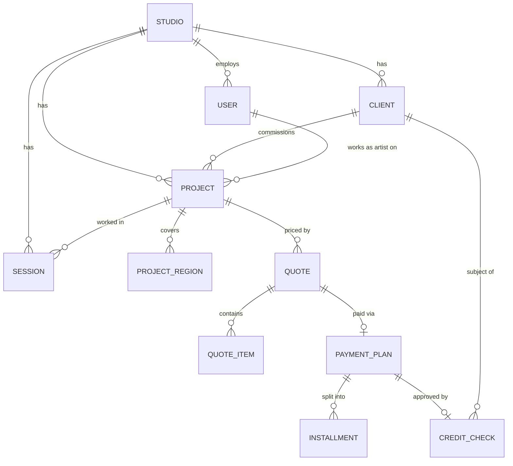
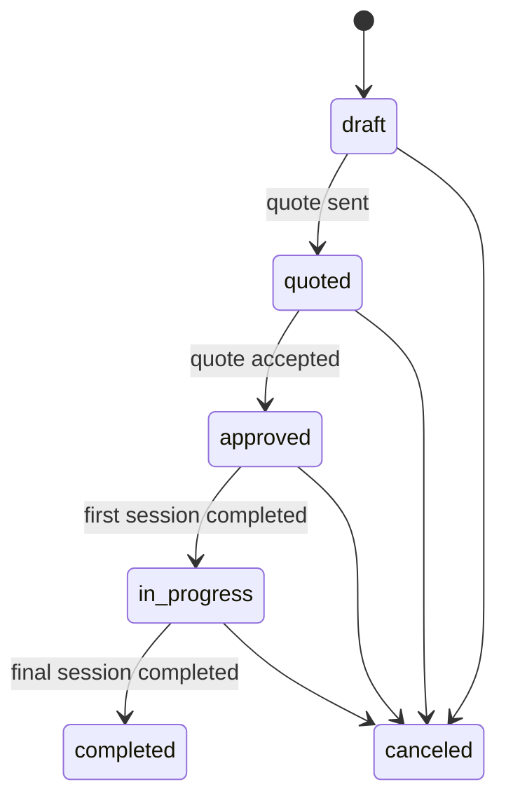
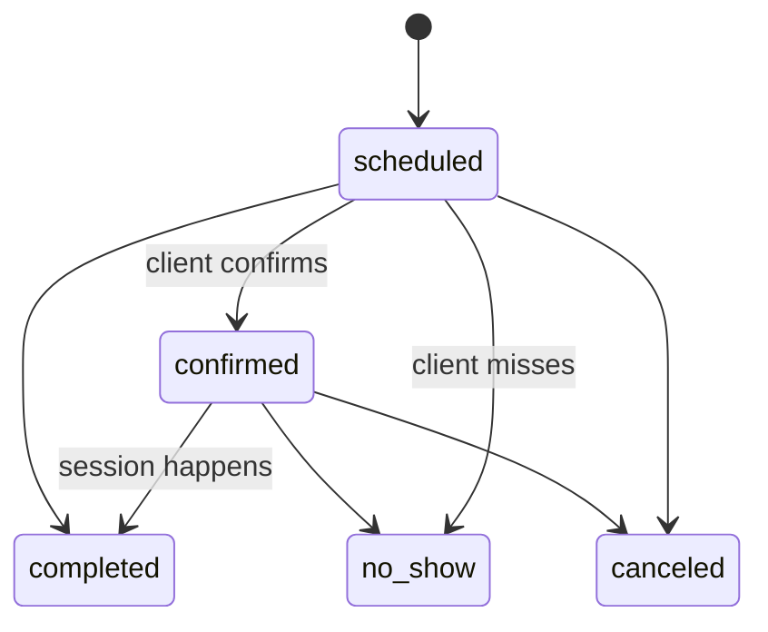
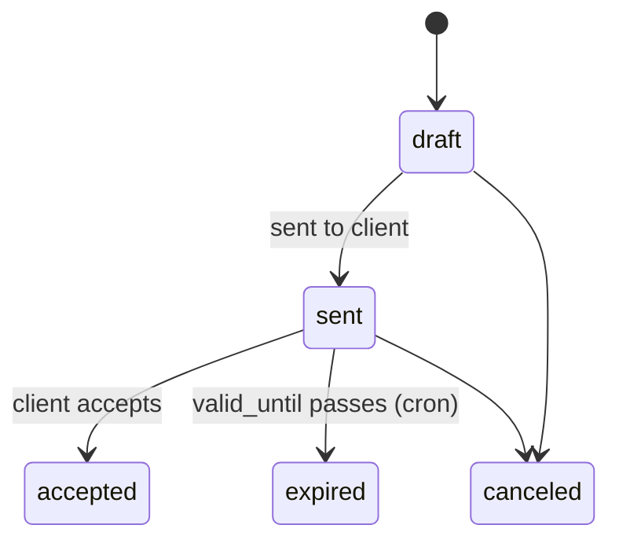
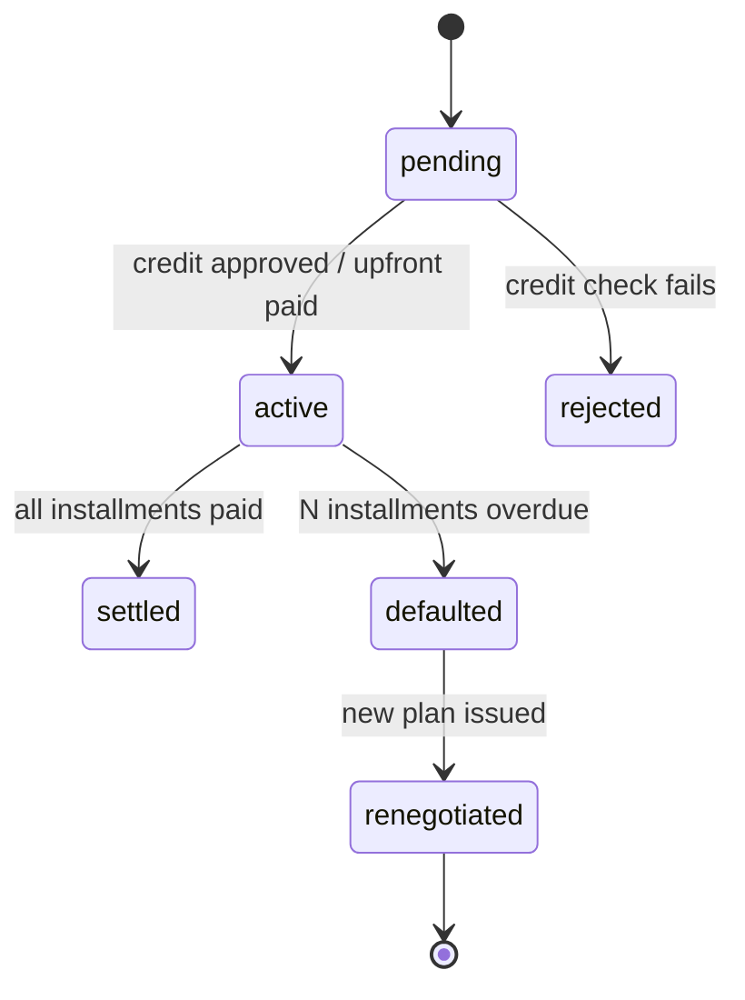
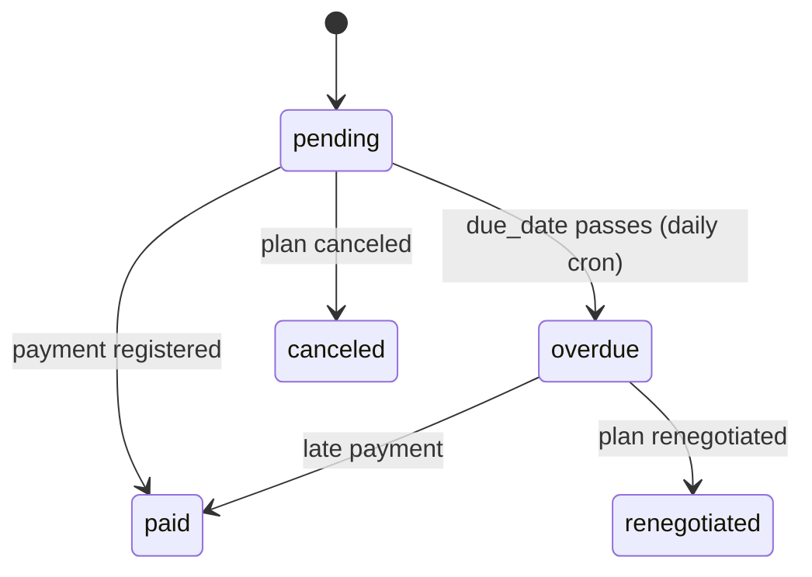

# 03 — Domain Model

## Entity-relationship overview



Every table except `studios` carries a `studio_id` (see [Tenancy](#multi-tenancy)).

## Entities

### Studio (the tenant)
The root of everything. `name`, `slug`, `cnpj` (optional), contact info, settings (jsonb).

### User
Staff who log in. Devise + JWT. `role` enum: `owner` / `artist` / `front_desk`. Artists have a `display_name`, portfolio URL, and a working-hours definition used by the calendar. Soft-deleted with `discarded_at` (people leave studios; their history stays).

### Client
The person getting tattooed. `name`, `cpf` (validated, unique per studio), `email`, `phone`, `birth_date`, `notes`. Soft-deleted. CPF is the identity key for credit checks.

### Project
A tattoo project. `title`, `style` enum (`fineline`, `blackwork`, `old_school`, `realism`, `geometric`, `watercolor`, `lettering`, `other`), `description`, `estimated_sessions`, references `client` and `artist` (a `User`).



### ProjectRegion (the body map)
The odontogram-equivalent. Each row marks one body region a project covers: `region` enum + `status` enum (`planned` / `in_progress` / `done`). The frontend renders these on an interactive SVG body figure.

Region enum (26 values):

```
head, face, neck,
chest, abdomen, upper_back, lower_back, ribs_left, ribs_right,
left_shoulder, left_upper_arm, left_forearm, left_hand,
right_shoulder, right_upper_arm, right_forearm, right_hand,
left_hip, left_thigh, left_knee, left_calf, left_foot,
right_hip, right_thigh, right_knee, right_calf, right_foot
```

Uniqueness: one row per `(project_id, region)`.

### Session
A calendar appointment. `starts_at`, `ends_at`, references `project`, `artist`, `client` (denormalized from project for query speed — a deliberate, documented denormalization). `price_cents` (optional per-session price), `notes`.



Rules the model must enforce (great TDD material):
- A session cannot overlap another session of the same artist.
- `completed` requires `starts_at` in the past.
- Completing the first session moves the project `approved → in_progress`.

### Quote
A priced proposal for a project. `discount_cents`, computed `total_cents`, `valid_until`.



**QuoteItem**: `description`, `quantity`, `unit_price_cents`, computed `total_cents`. A quote's total = sum of items − discount. All computed in Ruby from integers, tested exhaustively.

### PaymentPlan
How an accepted quote gets paid. `kind` enum: `upfront` / `installments`. For installments: `down_payment_cents`, `installments_count` (2–12), `first_due_date`. Creating an installment plan requires a `CreditCheck` with an approving score.



Renegotiation creates a **new** PaymentPlan referencing the old one (`parent_plan_id`), and the old plan's unpaid installments transition to `renegotiated` — the standard pattern for keeping financial history immutable.

### Installment
`number` (1..N), `amount_cents`, `due_date`, `paid_at`.



Installment amounts: total split evenly; remainder cents go to the **first** installment (documented, tested — e.g. R$ 1.000,00 in 3 = 33.334 + 33.333 + 33.333).

### CreditCheck
A snapshot of a SkinScore (mock bureau) response for a client's CPF: `score` (0–1000), `verdict` enum (`approved` / `manual_review` / `rejected`), `raw_response` (jsonb), `expires_at`. Checks are cached — a fresh check within 30 days is reused instead of hitting the bureau again (teaches caching-by-table with TTL).

## Multi-tenancy

Row-level isolation:

1. Every model (except `Studio`) has `belongs_to :studio` — enforced by a `MultiTenant` concern that also validates presence.
2. `Current` (`ActiveSupport::CurrentAttributes`) carries `Current.studio` and `Current.user`, set from the JWT on every request.
3. A default scope filters queries by `Current.studio` when present.
4. **The danger zones** — background jobs, consoles, and rake tasks have no `Current.studio`. Rules: jobs receive IDs and re-scope explicitly (`studio.installments.find(...)`); a custom RSpec matcher asserts every new model is tenant-scoped.

We use this model *because* its failure modes are instructive. The learning guide covers the alternatives (schema-per-tenant, `acts_as_tenant`) and their trade-offs.

## Money

- All monetary values are **integer cents** (`*_cents` columns, `bigint`).
- No floats, ever. Division uses integer math with explicit remainder policy.
- Formatting to "R$ 1.234,56" happens in the frontend (and a small `Money` helper module in Ruby for emails).

## Identity & auth model

- `User` authenticates with Devise + `devise-jwt`; JWT payload carries `user_id` and `studio_id`; 7-day expiry.
- Authorization by Pundit policies keyed on `role` (e.g. only `owner` can activate payment plans; artists can only edit their own sessions).
