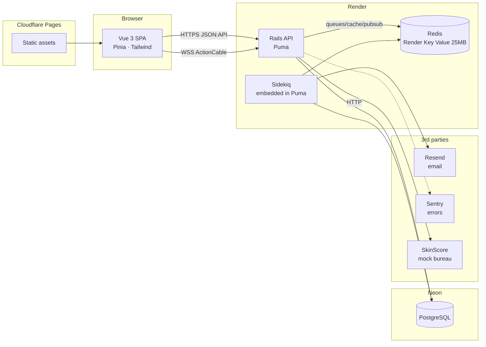
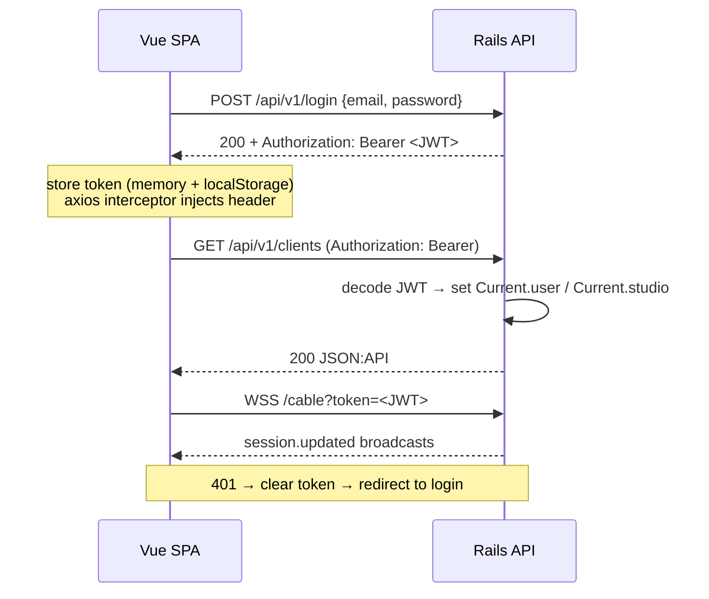

# 04 — Architecture

## System overview



## Backend

**Rails (latest stable) in API mode**, Ruby 3.3+.

| Concern | Choice | Rationale |
|---|---|---|
| Web server | Puma | Rails default; we'll study threads vs workers |
| Auth | Devise + devise-jwt | Industry-standard combo for SPA + Rails API |
| Authorization | Pundit | Small, explicit, testable policies |
| Serialization | jsonapi-serializer | Standard contract; teaches API design discipline |
| Pagination | Kaminari | Simple, pairs well with JSON:API meta |
| State machines | AASM | Declarative states/transitions, RSpec matchers |
| Background jobs | Sidekiq OSS + sidekiq-cron | The de-facto Rails job system; cron for scheduled work |
| Soft delete | discard | Tiny and explicit |
| Audit trail | paper_trail | Change history on financial models |
| Search | pg_search | Postgres FTS before reaching for search infra |
| Migrations safety | strong_migrations | Teaches what locks a production table |
| N+1 detection | bullet (dev/test) | Teaches the query patterns that hurt |
| HTTP client | Faraday | Middleware model, timeouts, retries |
| API docs | rswag | OpenAPI generated from request specs |
| Lint | RuboCop (rails + rspec + performance) | Same ruleset philosophy as production Rails shops |
| Security scan | Brakeman in CI | Free static analysis |

### Code organization

```
backend/
  app/
    adapters/skin_score/     # mock bureau HTTP client (client, payloads, responses)
    controllers/api/v1/      # thin controllers: auth → form/query → serializer
    forms/                   # write-path input objects
    jobs/                    # Sidekiq workers (thin: find + delegate to service)
    models/                  # AR models + AASM + concerns (MultiTenant)
    policies/                # Pundit
    queries/                 # read-path filter/pagination objects
    serializers/api/v1/
    services/                # business operations, one .call each
  spec/                      # mirrors app/, request specs are the integration layer
```

### API design

- REST, JSON:API media type, versioned under `/api/v1/`.
- Errors: consistent envelope `{errors: [{status, code, detail}]}`; validation errors map field-by-field.
- Pagination: `page[number]` / `page[size]` params, `meta.pagination` in responses.
- CORS locked to the frontend origin (not `*` — we do it right and document why).

### Auth flow



## Frontend

**Vue 3 + Vite + TypeScript (loose)**, Composition API with `<script setup>`.

| Concern | Choice | Rationale |
|---|---|---|
| State | Pinia | Vue 3 standard |
| Router | vue-router 4, HTML5 history | Route guards for auth/roles |
| HTTP | axios, one instance + interceptors | Auth injection, 401 handling |
| Styling | Tailwind CSS | Utility-first + our own `Tin*` design system on top |
| Forms | vee-validate + zod | Schema-based validation shared conventions |
| Dates | date-fns | Tree-shakeable |
| Realtime | @rails/actioncable | Calendar live updates |
| Unit tests | Vitest + Vue Test Utils | Fast, Vite-native |
| E2E | Cypress | A few critical-path specs (login, book session, accept quote) |

```
frontend/
  src/
    api/            # one file per resource + httpClient.js
    components/
      design-system/  # TinButton, TinModal, TinTable, ...
    composables/    # useWebSocket, usePagination, ...
    router/         # routes + guards
    stores/         # Pinia, one per domain
    views/          # route-level pages
```

## Infrastructure (Phase A: free PaaS)

| Piece | Provider | Free-tier constraint we live with |
|---|---|---|
| Rails API | Render free web service | Sleeps after ~15 min idle → first request takes ~30s (cold start) |
| Sidekiq | **Embedded in the Puma process** (Sidekiq 7 embedding API) | Render free tier has no free background workers; embedding teaches the same Sidekiq concepts, and we split it into a real separate process during the VPS migration |
| Cron | sidekiq-cron inside the embedded Sidekiq | Same |
| Postgres | Neon free | 0.5 GB, autosuspends (first query wakes it) |
| Redis | Render Key Value free | 25 MB, **no persistence** — acceptable: queues re-derive from DB state (overdue detection is idempotent) |
| SPA | Cloudflare Pages | Effectively no constraint |
| Email | Resend free | 3k emails/month, 100/day |
| Errors | Sentry free | 5k events/month |
| Uptime | UptimeRobot free | 5-min checks against `/health` |
| CI/CD | GitHub Actions | Free for public repos |

**Environments:** `development` (local) and `production` only. No staging — at this scale, a staging env would teach less than it costs. Local dev uses Docker Compose for Postgres + Redis (mirrors the "infra as containers" approach production shops use).

**Deploys:** push to `main` → GitHub Actions runs the full test suite → on green, Render auto-deploys the backend (with `rails db:migrate` release step) and Cloudflare Pages builds the frontend. Migrations must always be backward-compatible with the running code (strong_migrations helps enforce the discipline).

## Infrastructure (Phase B: VPS + Kamal — the migration arc)

A late roadmap phase migrates the whole stack to a free VPS (Oracle Cloud Always Free) deployed with **Kamal**: Docker containers, Traefik/kamal-proxy, Let's Encrypt TLS, nginx-style routing, self-hosted Postgres + Redis, real separate Sidekiq process, firewall config, DNS.

This mirrors what real companies go through (PaaS → owned infra) and is where the *networks* part of the learning goals gets hands-on: ports, reverse proxies, TLS certificates, DNS records, SSH, systemd, backups.

## Observability

- `/health` endpoint: checks DB + Redis connectivity, returns build SHA.
- Structured logs (request ID, studio ID) — reading production logs is a first-class skill.
- Sentry for exceptions (backend + frontend).
- `rails_performance` or plain log analysis before reaching for an APM.
